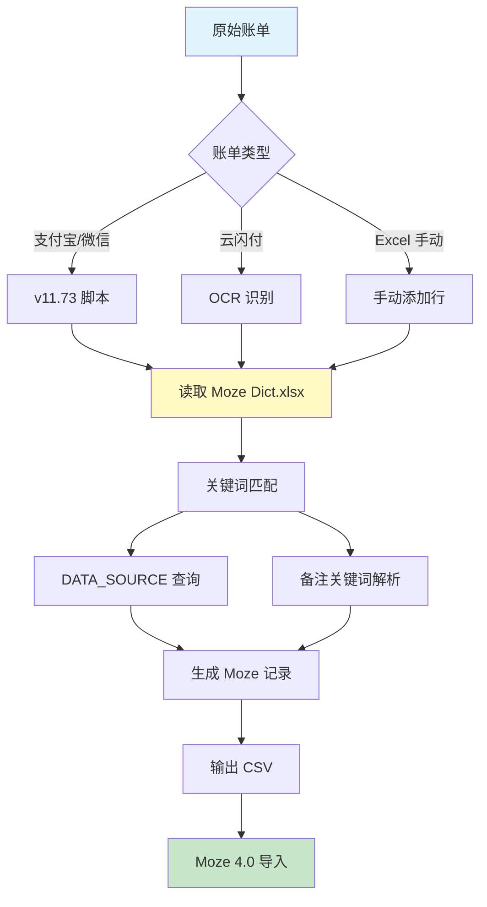
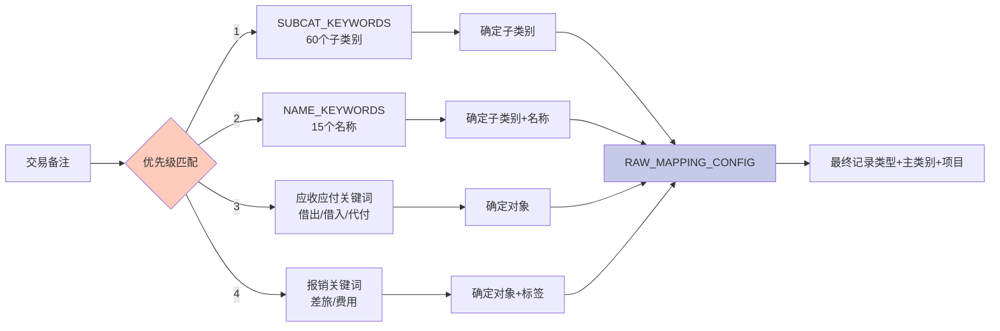
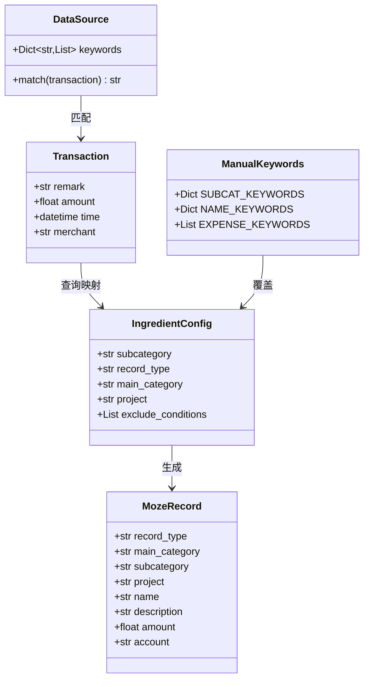
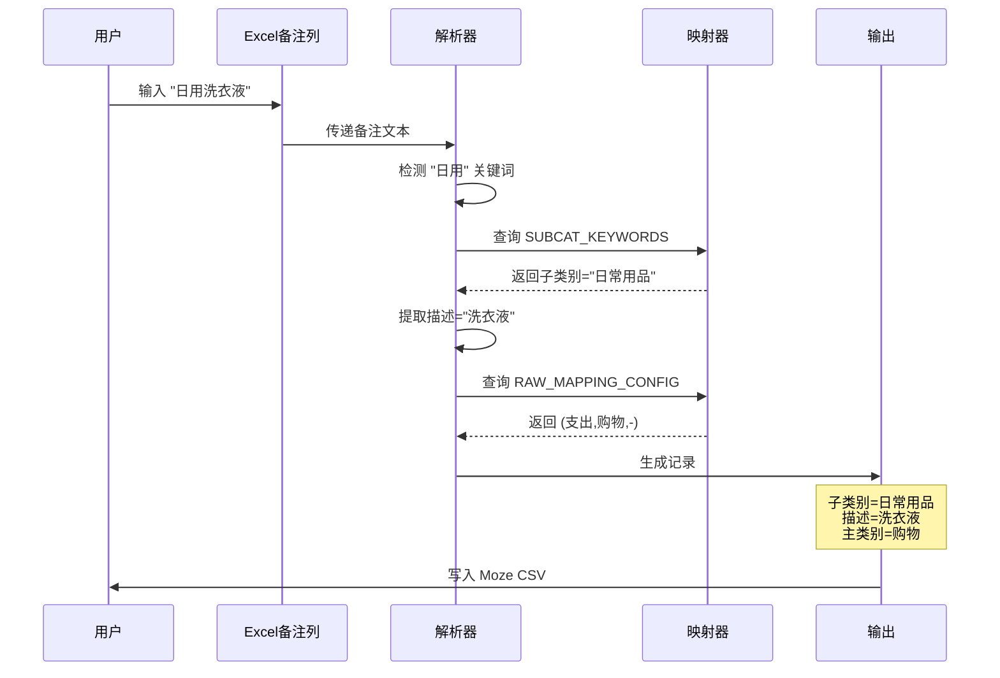
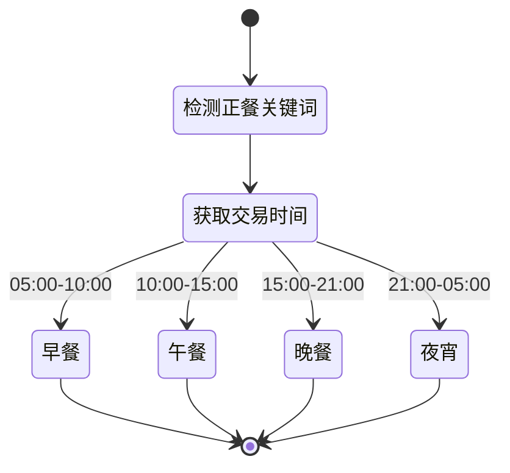
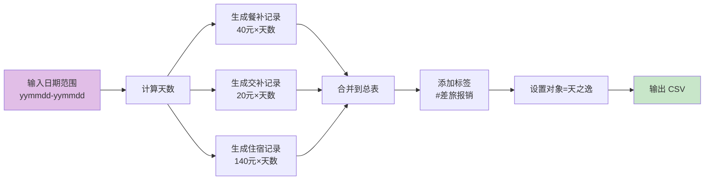
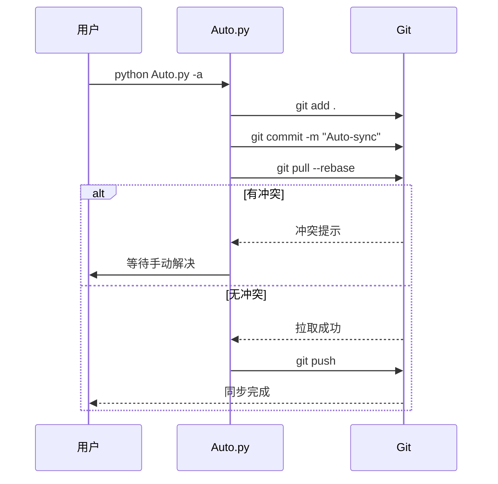
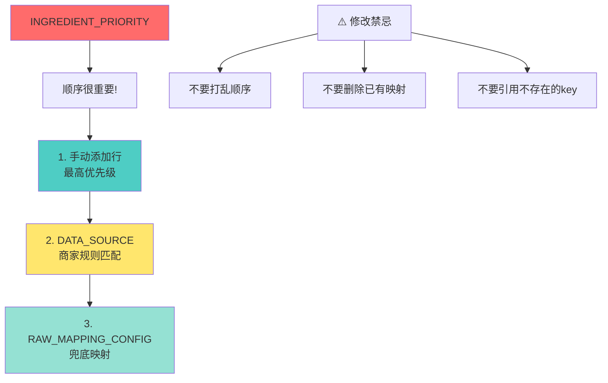

# Mermaid 图表示例

本文档展示 Moze 4.0 账单转换工具的核心流程和数据结构。

## 1. 整体工作流程

## 2. 关键词匹配优先级

## 3. 数据结构关系

## 4. 手动添加行处理流程

## 5. 时间推导逻辑

## 6. 报销生成流程

## 7. Git 自动同步流程

## 8. 配置数据优先级

## 使用说明

在支持 Mermaid 的 Markdown 预览器中打开本文件即可查看图表：

- **VS Code**: 安装 `Markdown Preview Mermaid Support` 插件
- **Typora**: 原生支持
- **GitHub**: 原生支持
- **在线工具**: https://mermaid.live

